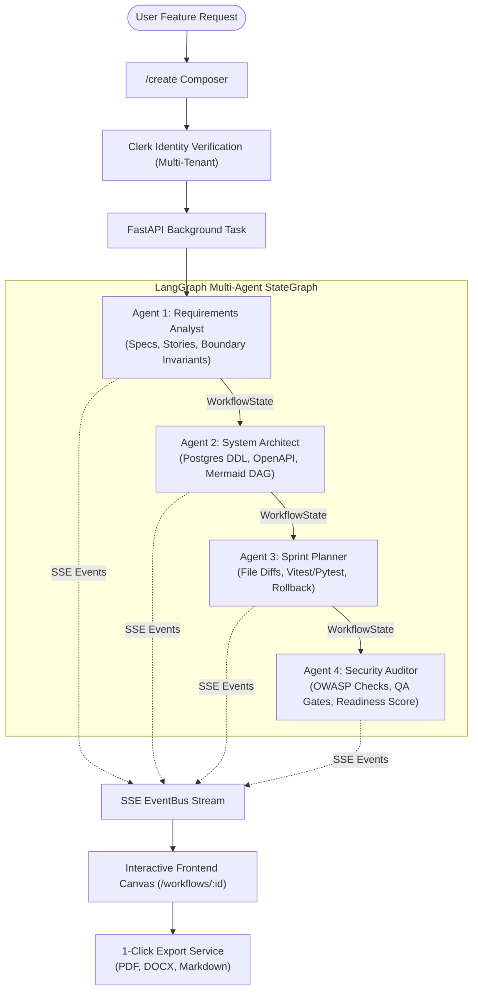

# FlowForge AI — Multi-Agent Software Engineering Assistant

> **Cadence Internship Selection — Project 4: Multi-Agent Software Engineering Assistant**  
> An autonomous multi-agent pipeline that transforms raw software feature requests into production-ready specifications, relational schemas, implementation roadmaps, and security audits using **LangGraph**, **FastAPI**, **Next.js 16**, and **Clerk**.

---

## 🎯 Problem Statement Fulfillment

| Requirement from Specification | Implementation in FlowForge AI | Status |
| :--- | :--- | :---: |
| **Feature Request Intake** | Natural language intake studio at `/create` with curated starters, keyboard shortcuts, character validation, and live query parameter injection from the Web Research Hub. | ✅ |
| **Stage 1: Requirements Analysis** | Specialized **Requirements Analyst Agent** (`requirements_node.py`) synthesizing functional requirements, user stories, acceptance criteria, and edge-case boundary invariants. | ✅ |
| **Stage 2: Solution Design** | Specialized **System Architect Agent** (`design_node.py`) generating architectural overview, relational PostgreSQL DDL schemas, OpenAPI 3.1 REST contracts, and interactive Mermaid architecture diagrams. | ✅ |
| **Stage 3: Implementation Planning** | Specialized **Senior Staff Engineer Agent** (`implementation_node.py`) orchestrating file-by-file changes, step-by-step diff plans, test suites (Vitest/Pytest), dependencies, and rollback mitigation strategies. | ✅ |
| **Stage 4: Code Review** | Specialized **QA & Security Auditor Agent** (`review_node.py`) conducting OWASP Top 10 security audits, test coverage assessments, code maintainability scoring, and synthetic gate verification. | ✅ |
| **Logical Task Breakdown** | Strict Pydantic and TypedDict state schemas (`WorkflowState`) enforcing structured JSON decomposition across all pipeline transitions. | ✅ |
| **End-to-End Workflow Visibility** | Real-time Server-Sent Events (SSE) streaming (`/stream`) with per-node live status updates, interactive DAG modal, execution telemetry (tokens/s, latency), and execution history. | ✅ |

---

## 🏗️ Architecture & Orchestration Flow



---

## 🚀 Key Features

1. **Deterministic LangGraph DAG Engine**:
   - Compiled `StateGraph` chaining 4 specialized LLM agent nodes with context passing and state isolation.
   - Resilient provider fallback mechanism (Gemini $\to$ simulated offline provider).

2. **Zero-Latency Live Streaming (SSE)**:
   - High-throughput Server-Sent Events (`text/event-stream`) pushing real-time progress, token updates, and completed stage payloads directly to the browser without polling.

3. **Cryptographic Clerk Authentication & Multi-Tenant Isolation**:
   - Guests can explore the landing page and architecture tour.
   - Protected routes (`/create`, `/history`, `/research`, `/workflows/:id`) enforce Clerk authentication.
   - Database queries are strictly scoped to the authenticated Clerk user ID, preventing cross-user history leakage.

4. **Live Web Research Hub**:
   - Real-time technical documentation crawler integrating DuckDuckGo to gather live API benchmarks and library specifications, injecting findings directly into the feature composer.

5. **Multi-Format Export Engine**:
   - High-fidelity **PDF** generation with tabular formatting and status badges.
   - Formatted Microsoft Word (**`.docx`**) deliverable export.
   - Publication-ready GitHub Flavored **Markdown** export.

6. **Apple/Stripe-Caliber Design System**:
   - Distinct typography: **Outfit** (`font-header`) for headers and **JetBrains Mono** (`font-footer`) for engineering telemetry.
   - Metallic brushed-platinum / brushed-titanium design primitives with specular highlights.
   - Dynamic animated counters and pure CSS Grid collapsible accordions (Shadcn UI).
   - Seamless **Dark / Light mode** toggle with calibrated text contrast and atmospheric backgrounds.

---

## 💻 Tech Stack

- **Frontend**: Next.js 16 (App Router), React 19, TypeScript, Tailwind CSS v4, Motion, Lucide React, Mermaid.js.
- **Backend**: FastAPI, Python 3.14 / 3.11+, LangGraph, LangChain, Google Gemini API, Uvicorn, SQLAlchemy (Async).
- **Authentication**: Clerk (@clerk/nextjs).
- **Database**: SQLite with async SQLAlchemy driver (production-ready for PostgreSQL).
- **Real-Time**: Server-Sent Events (SSE) with `sse-starlette` and `asyncio.Queue` EventBus.

---

## 🛠️ Quickstart Guide

### Prerequisites
- Python 3.10+
- Node.js 18+ and npm
- (Optional) Gemini API Key for live AI responses (simulated fallback included out of the box)
- Clerk API keys for authentication

### 1. Backend Setup

```bash
cd backend

# Install dependencies
pip install -r requirements.txt

# Create .env (copy from .env.example)
cp .env.example .env

# Run FastAPI server
python -m uvicorn main:app --reload --port 8010
```

Backend will be available at: `http://localhost:8010`  
API Documentation (Swagger UI): `http://localhost:8010/docs`

### 2. Frontend Setup

```bash
cd frontend

# Install dependencies
npm install

# Run development server
npm run dev
```

Frontend will be available at: `http://localhost:3000`

---

## 🔒 Security & Privacy

- **Zero LLM Data Training**: Prompts and synthesized workflows are never used to train foundational AI models.
- **Multi-Tenant Data Scoping**: All database records are cryptographically tagged with the authenticated Clerk user ID.
- **TLS 1.3 Encryption**: All API communications and SSE streams operate over encrypted channels.
