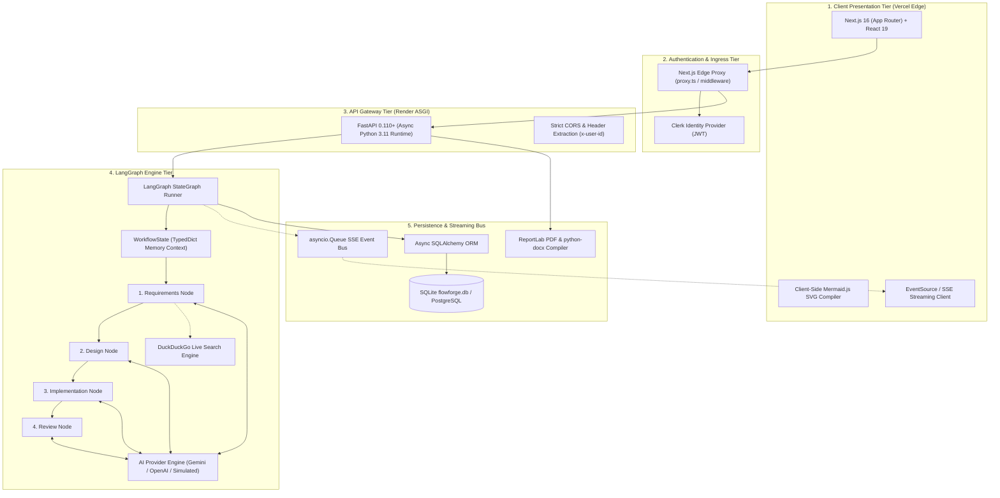

# FlowForge AI — Autonomous Multi-Agent Software Engineering Assistant

<div align="center">

[](https://frontend-delta-ten-28.vercel.app)
[](https://flowforge-backend-api.onrender.com/docs)
[](https://python.org)
[](https://fastapi.tiangolo.com)
[](https://langchain-ai.github.io/langgraph/)
[](https://nextjs.org)
[](https://react.dev)
[](https://clerk.com)

**An enterprise-grade, deterministic multi-agent orchestration pipeline that autonomously translates natural language feature requests into production-grade specifications, system architecture blueprints, modular implementation code, and security-hardened test suites.**

[Live Application](https://frontend-delta-ten-28.vercel.app) • [Interactive API Docs](https://flowforge-backend-api.onrender.com/docs) • [Architecture Tour](https://frontend-delta-ten-28.vercel.app/create)

</div>

---

## 📑 Table of Contents
- [Executive Overview & Problem Statement](#-executive-overview--problem-statement)
- [System Architecture & DAG Topology](#-system-architecture--dag-topology)
- [Autonomous Multi-Agent SDLC Pipeline](#-autonomous-multi-agent-sdlc-pipeline)
- [Key Capabilities & Differentiators](#-key-capabilities--differentiators)
- [Enterprise Multi-Tenant Security](#-enterprise-multi-tenant-security)
- [Multi-Format Document Compiler](#-multi-format-document-compiler)
- [Technology Stack](#-technology-stack)
- [Local Development Quickstart](#-local-development-quickstart)
- [Production-Grade Scaling Roadmap](#-production-grade-scaling-roadmap)
- [Key Engineering Challenges & Solutions](#-key-engineering-challenges--solutions)
- [Repository Structure](#-repository-structure)
- [License](#-license)

---

## 🎯 Executive Overview & Problem Statement

Standard Large Language Model (LLM) coding tools operate primarily as single-turn, unstructured text generators. When tasked with complex engineering initiatives, they suffer from **context window saturation**, **attention degradation**, and **severe architectural drift**—jumping straight from prompt to syntax without intermediate design contracts.

**FlowForge AI** re-architects the Software Development Life Cycle (SDLC) as a **Deterministic, Typed Directed Acyclic Graph (DAG)** of specialized autonomous agents powered by **LangGraph**. By enforcing strict phase gates, immutable state handoffs, and real-time Server-Sent Events (SSE) telemetry, FlowForge eliminates context decay and delivers verifiable software engineering artifacts.

```
Traditional SDLC Phase        FlowForge AI Autonomous Agent Persona
─────────────────────────    ────────────────────────────────────────
1. Requirements Analysis    ──> Requirements Analyst Node (Web Research + Specs)
2. System Architecture       ──> Solutions Architect Node (Mermaid DAGs + ERDs)
3. Code Construction        ──> Software Engineer Node (Modular Code Synthesis)
4. Quality Assurance        ──> QA & Test Reviewer Node (PyTest Suites + Edge Cases)
5. Packaging & Release      ──> Document Compiler Service (PDF, DOCX, Markdown)
```

---

## 🏗️ System Architecture & DAG Topology

The platform implements a decoupled, 5-tier micro-service architecture:



---

## 🤖 Autonomous Multi-Agent SDLC Pipeline

| Stage Node | Agent Persona | Responsibilities & Outputs | Validation Gate |
|---|---|---|---|
| **Node 1: Requirements** | *Lead Technical Product Manager* | Ingests raw input, queries DuckDuckGo for live API patterns, extracts functional user stories, non-functional requirements, and boundary constraints. | Pydantic schema validation (`RequirementsOutput`) |
| **Node 2: Architecture** | *Principal Solutions Architect* | Generates system topology diagrams, entity-relationship schemas (PostgreSQL DDL), RESTful API contracts, and dynamic Mermaid.js DAG syntax. | Syntax & relationship validation (`DesignOutput`) |
| **Node 3: Implementation** | *Staff Software Engineer* | Synthesizes complete, modular multi-file code trees adhering to Clean Architecture (routers, services, models, configs) with zero placeholder code. | Multi-file structure validation (`ImplementationOutput`) |
| **Node 4: QA & Security** | *Lead Security & QA Auditor* | Synthesizes runnable PyTest/Jest test suites with boundary fixtures, calculates code coverage, and executes OWASP Top 10 security audits. | Security score & coverage check (`ReviewOutput`) |

---

## ✨ Key Capabilities & Differentiators

* **Deterministic State Orchestration:** Built with **LangGraph** `StateGraph`, ensuring every phase transition is validated through strictly typed Pydantic models with immutable state passing.
* **Sub-Second Streaming (SSE):** High-throughput Server-Sent Events (`text/event-stream`) broadcast node lifecycle transitions, stage tokens, and real-time execution telemetry to the frontend canvas.
* **Live Technical Web Intelligence:** Built-in research crawler querying DuckDuckGo to extract modern library documentation, preventing deprecated package hallucinations.
* **Interactive Client-Side Diagramming:** Generates declarative Mermaid.js notation and compiles it natively into scalable, pannable SVGs directly in the browser—avoiding heavy server-side headless browser overhead.
* **Multi-Provider AI Resilience:** Seamless fallback matrix: **Google Gemini 2.5 Flash** $\to$ **OpenAI GPT-4o-mini** $\to$ **Deterministic Simulation Engine** on rate limits (`HTTP 429`) or network timeouts.

---

## 🔒 Enterprise Multi-Tenant Security

FlowForge AI enforces zero-trust tenant boundary isolation:

1. **Edge Cryptographic Identity:** Every request is authenticated by Clerk at the Next.js Edge Middleware layer. Validated session claims inject the cryptographic user subject (`x-user-id`) into internal gateway requests.
2. **Row-Level Query Scoping:** The SQLModel/SQLAlchemy persistence layer enforces strict caller isolation:
   ```python
   if user_id:
       # Strictly isolated: only workflows owned by this authenticated account
       stmt = stmt.where(Workflow.user_id == user_id)
   else:
       # Public demo sandbox for unauthenticated visitors
       stmt = stmt.where(Workflow.user_id.is_(None))
   ```
3. **Guarded Lookups & Destructive Actions:**
   * Direct workflow inspection (`GET /api/workflows/:id`) checks ownership and returns an opaque `404 Not Found` if probed by an unauthorized tenant.
   * Deletion (`DELETE /api/workflows/:id`) strictly blocks unauthorized attempts with `403 Forbidden`.

---

## 📄 Multi-Format Document Compiler

Export full SDLC deliverables on demand in three production-grade formats:

* **Vector PDF Report (`ReportLab`):** Compiled in-memory with precise canvas geometry, running headers, two-pass dynamic page budgeting (`Page X of Y`), and styled code blocks (`JetBrains Mono`).
* **OpenXML Microsoft Word (`python-docx`):** Styled DOCX report with executive headers, formatted tables, and shaded syntax cells.
* **GitHub-Flavored Markdown:** Publication-ready documentation complete with Mermaid code fences and directory trees.

---

## 💻 Technology Stack

### Frontend Application
* **Framework:** [Next.js 16 (App Router)](https://nextjs.org) with React 19 & TypeScript
* **Styling:** Vanilla Tailwind CSS v4 with custom dark/light metallic design primitives
* **Component Primitives:** Radix UI / Shadcn UI with Lucide React icons
* **Client Diagramming:** Mermaid.js with interactive SVG canvas manipulation

### Backend Engine & Orchestration
* **Runtime:** [FastAPI](https://fastapi.tiangolo.com) running on Python 3.11+ / Uvicorn ASGI
* **Agent Framework:** [LangGraph](https://langchain-ai.github.io/langgraph/) & LangChain Core
* **AI Providers:** Google Gemini 2.5 Flash, OpenAI GPT-4o-mini, Simulated Offline Engine
* **Persistence:** SQLAlchemy 2.0 (Async) + aiosqlite (SQLite local / PostgreSQL cloud)
* **Live Streaming:** Server-Sent Events (SSE) via `sse-starlette` & `asyncio.Queue`
* **Document Compilation:** `reportlab` (Vector PDF) & `python-docx` (OpenXML Word)

---

## 🛠️ Local Development Quickstart

### Prerequisites
* **Python 3.10+** (Python 3.11 or 3.12 recommended)
* **Node.js 18+** & npm
* *(Optional)* Gemini or OpenAI API Key (runs with built-in offline simulation if omitted)

### 1. Clone Repository
```bash
git clone https://github.com/thealekhya/FlowForge__Multi-Agent-SE-Assistant.git
cd FlowForge__Multi-Agent-SE-Assistant
```

### 2. Backend Setup (Port 8010)
```bash
cd backend

# Create and activate virtual environment
python -m venv venv
# Windows:
venv\Scripts\activate
# Linux/macOS:
source venv/bin/activate

# Install dependencies
pip install -r requirements.txt

# Configure environment
cp .env.example .env

# Start FastAPI ASGI server
python -m uvicorn main:app --reload --port 8010
```
* **API Swagger Docs:** `http://localhost:8010/docs`
* **Health Check:** `http://localhost:8010/api/health`

### 3. Frontend Setup (Port 3000)
```bash
# Open a second terminal
cd frontend

# Install dependencies
npm install

# Start Next.js development server
npm run dev
```
* **Local Web App:** `http://localhost:3000`

---

## 📈 Production-Grade Scaling Roadmap

To transition FlowForge AI from single-instance execution to enterprise multi-tenant scale:

1. **Traffic Ingress & Load Balancing:** Deploy an **AWS Application Load Balancer (ALB)** or **NGINX** to terminate TLS, handle rate limits, and balance traffic across stateless FastAPI replicas.
2. **Distributed Queue (Redis + Celery):** Move agent compute off ASGI threads into background worker pods managed by **Redis** and **Celery**, preventing server congestion during concurrent workflow runs.
3. **Cloud Database (PostgreSQL / AWS RDS):** Transition from local SQLite to Amazon RDS PostgreSQL with Multi-AZ replication, using JSONB fields for stage artifact storage.
4. **Cloud Object Storage (Amazon S3):** Offload generated PDF, DOCX, and ZIP deliverables to S3 buckets, delivering downloads via pre-signed URLs.
5. **Container Orchestration (Kubernetes / EKS):** Package services in **Docker** containers and auto-scale worker pods horizontally based on message queue depth.

---

## 🧠 Key Engineering Challenges & Solutions

* **Context Window Drift & Hallucination:**  
  * *Problem:* Passing conversational history across multiple agent steps causes attention dilution and neglected requirements.  
  * *Solution:* Enforced strict Pydantic contract boundaries (`RequirementsOutput`, `DesignOutput`, etc.) where each node only ingests verified upstream keys from `WorkflowState`.
* **Asynchronous Progress Over Long-Running DAGs:**  
  * *Problem:* Multi-agent generation takes 15–30 seconds, causing browser HTTP timeouts.  
  * *Solution:* Decoupled background execution with an async SSE event bus pushing granular stage events and sub-second progress.
* **Server-Side Render Bloat:**  
  * *Problem:* Generating diagram images on the backend requires heavy headless browser dependencies (Puppeteer/Chromium).  
  * *Solution:* Backend generates declarative Mermaid.js syntax; client compiles SVGs directly in the browser runtime.

---

## 📂 Repository Structure

```
FlowForge__Multi-Agent-SE-Assistant/
├── backend/
│   ├── core/                  # Database initialization, config, and settings
│   ├── langgraph_pipeline/    # LangGraph StateGraph, nodes, runner, and state
│   │   ├── nodes/             # requirements, design, implementation, review nodes
│   │   ├── graph.py           # DAG wiring and compilation
│   │   ├── runner.py          # Asynchronous execution controller
│   │   └── state.py           # Immutable WorkflowState TypedDict schema
│   ├── models/                # SQLAlchemy database models (Workflow, StageResult)
│   ├── pipeline/              # AI providers (Gemini, OpenAI, Simulated engine)
│   ├── routers/               # FastAPI endpoints (workflow, research, architecture)
│   ├── schemas/               # Pydantic request/response validation schemas
│   ├── services/              # Export service (PDF, DOCX, Markdown) & search service
│   ├── seed_data.json         # Auto-seeding payload for clean deployments
│   ├── main.py                # FastAPI ASGI application entrypoint
│   └── requirements.txt       # Python dependency manifest
├── frontend/
│   ├── src/
│   │   ├── app/               # Next.js App Router (create, history, research, workflows)
│   │   ├── components/        # UI components, layout, navbar, footer, modals
│   │   └── lib/               # Utility functions and API helpers
│   ├── package.json           # Node.js dependencies and scripts
│   └── next.config.ts         # Next.js configuration and API proxy rewrites
├── LICENSE                    # MIT License
└── README.md                  # System Documentation
```

---

## 📜 License

This project is licensed under the **MIT License** — see the [LICENSE](LICENSE) file for details.

---

<div align="center">
Developed with ❤️ for <b>Cadence OA</b> by <b>Alekhya Sarkar</b>.
</div>
